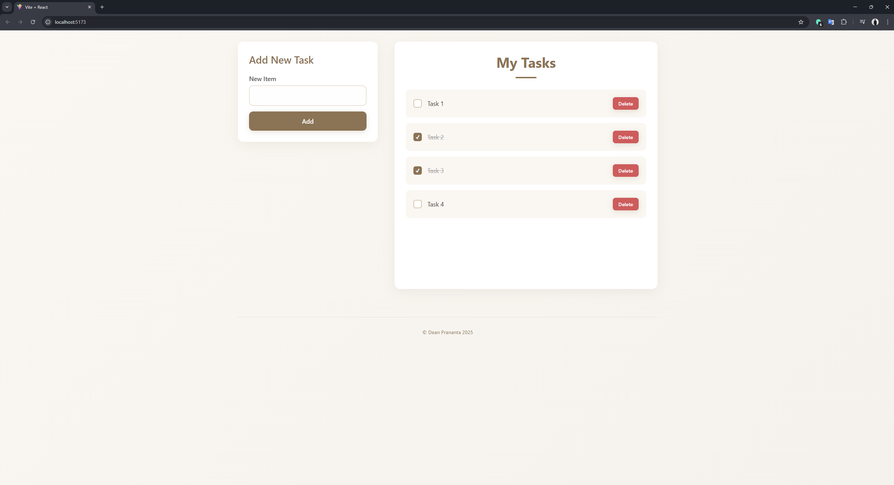

# Simple ToDo List App

A clean and modern ToDo list application built with React and Vite, featuring a beautiful cream-colored theme and intuitive user interface.

## Features

- ✅ Add new tasks
- ✅ Mark tasks as completed
- ✅ Delete tasks
- ✅ Persistent storage (localStorage)
- ✅ Responsive design
- ✅ Modern UI with smooth animations
- ✅ Split-screen layout (form on left, tasks on right)

## Screenshots



## Technologies Used

- **React** - Frontend framework
- **Vite** - Build tool and development server
- **CSS3** - Styling with modern features
- **LocalStorage** - Data persistence

## Getting Started

### Prerequisites

- Node.js (version 14 or higher)
- npm or yarn

### Installation

1. Clone the repository:

```bash
git clone https://github.com/yourusername/simple-todo-list.git
cd simple-todo-list
```

2. Install dependencies:

```bash
npm install
```

3. Start the development server:

```bash
npm run dev
```

4. Open your browser and navigate to `http://localhost:5173`

## Available Scripts

- `npm run dev` - Start development server
- `npm run build` - Build for production
- `npm run preview` - Preview production build
- `npm run lint` - Run ESLint

## Project Structure

```
src/
├── App.jsx          # Main application component
├── NewTodoForm.jsx  # Form component for adding new tasks
├── TodoList.jsx     # List component for displaying tasks
├── TodoItem.jsx     # Individual task item component
├── footer.jsx       # Footer component
├── style.css        # Global styles
└── main.jsx         # Application entry point
```

## Design Features

- **Split Layout**: Form on the left, task list on the right
- **Cream Theme**: Warm, comfortable color scheme
- **Smooth Animations**: Hover effects and transitions
- **Responsive Design**: Works on desktop and mobile
- **Modern UI**: Cards, shadows, and rounded corners

## Contributing

1. Fork the project
2. Create your feature branch (`git checkout -b feature/AmazingFeature`)
3. Commit your changes (`git commit -m 'Add some AmazingFeature'`)
4. Push to the branch (`git push origin feature/AmazingFeature`)
5. Open a Pull Request

## License

This project is open source and available under the [MIT License](LICENSE).

## Author

**Dean Prananta** - 2025

---

⭐ If you found this project helpful, please give it a star!
